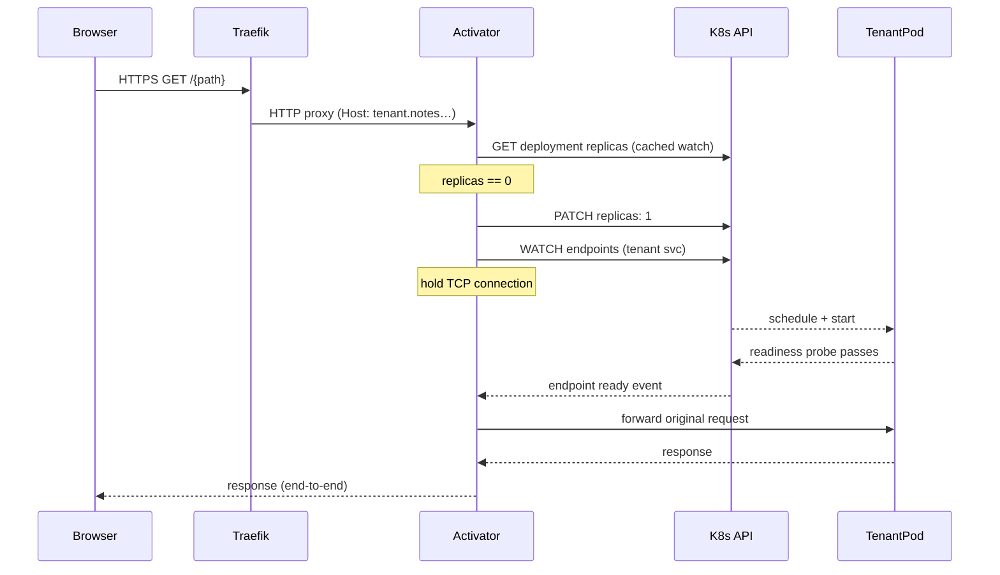

# Spike: scale-to-zero tenants with HTTPS wake-on-request activator

**Issue:** #340
**Date:** 2026-05-19
**Author:** Brand (platform)
**Status:** Spike complete — pending user approval on open questions before PoC.

> Claims verified post-spike against upstream sources: KEDA HTTP add-on architecture
> and install footprint verified against `kedacore/http-add-on` manifests and README
> (<https://github.com/kedacore/http-add-on>). Knative Serving networking requirements
> and activator behavior verified via Context7 against `knative/docs` and
> `knative/serving` (<https://github.com/knative/docs>, <https://github.com/knative/serving>).
> One correction applied: KEDA core ships 3 pods (operator, metrics-apiserver,
> admission-webhooks), not 2 — total combined footprint is ~6 pods, not ~5.
> Home-grown section expanded 2026-05-19: Traefik routing hypothesis verified via
> Context7 against `doc.traefik.io/traefik`. Pattern A (conditional routing on zero
> ready endpoints) is not natively supported. Pattern A′ (TraefikService failover on
> 503) is documented as a PoC validation target. Pattern B (activator as sole backend)
> selected as the reliable default. Recommendation revised to home-grown after full
> architecture expansion and honest rescore.

---

## Context

Issue #340 describes a resource waste problem: each tenant in our multi-tenant k3s
deployment on a single Azure VM runs at least one replica continuously, even when
idle. For hobbyist / asymmetric usage patterns (most tenants quiet most of the time)
this wastes CPU and RAM on a fixed-size node.

The goal is: a tenant idle for N minutes scales to zero replicas; the next HTTPS
request to `{tenant}.notes.daydreamsoftware.ca` wakes it transparently — latency
visible but no error surfaced to the user.

Far-future scope: 1..N horizontal scaling once awake (standard HPA on CPU/RPS). Not
designed here, but the activator pick must not block that path.

---

## Comparison matrix

Three approaches were evaluated. Scoring legend: + = advantage, ~ = neutral, - = disadvantage.

### Criteria

| Criterion | Weight rationale |
|---|---|
| Install footprint on k3s + Traefik | We already run a single-node k3s with Traefik; operators we can't install without heavyweight changes are non-starters |
| Operational complexity | Single VM, small ops team; anything with a multi-component control loop needs to earn its keep |
| Cold-start budget | Issue target: < 10 s; activator must buffer the first request, not reject it |
| Observability hooks | Prometheus metrics or equivalent — existing stack unknown but we need at least request queue depth |
| Fit with existing control-plane | Provisioning is done via `kubernetes-client` (Node); the control-plane writes `Deployment` objects — changes here are bounded |
| Future 1..N HPA path | Must not require a control-plane rewrite to add HPA later |

---

### Option A — KEDA HTTP add-on

KEDA (Kubernetes Event-Driven Autoscaling) is a CNCF project that extends the
Kubernetes HPA using custom metrics. The HTTP add-on is a separate sub-project
(`kedacore/http-add-on` / `kedify/http-add-on`) that implements HTTP-triggered
scale-from-zero specifically.

**How it works.**
An `HTTPScaledObject` CRD is created per tenant, referencing the tenant's Deployment
and Service. A cluster-level interceptor proxy (one Deployment) captures HTTP
traffic forwarded to it and enqueues requests while scaling happens; a per-`HTTPScaledObject`
external-scaler watches the queue depth and signals KEDA core to scale the target
Deployment. When replicas reach 1 and the readiness probe passes, the interceptor
forwards the buffered request.

Traffic routing with Traefik: the tenant Ingress must point to the KEDA interceptor
Service (not the tenant Service directly). When awake the interceptor forwards to the
tenant; when asleep it holds the connection. There is no native Traefik middleware for
this; the Ingress backend change is the main integration cost.

**Install footprint.**
KEDA core: three pods (operator, metrics-apiserver, admission-webhooks). KEDA HTTP
add-on: three components (interceptor, scaler, operator). Total: ~6 pods of modest
size. No service mesh required. No Istio, no Kourier.

**Scores:**

| Criterion | Score | Notes |
|---|---|---|
| Install footprint | + | ~6 pods, no service mesh; fits on a single node |
| Operational complexity | ~ | CRD-per-tenant is manageable; interceptor is new data path |
| Cold-start budget | + | Interceptor holds connection; request is queued, not rejected |
| Observability | + | KEDA exposes Prometheus metrics; queue depth per `HTTPScaledObject` |
| Fit with control-plane | ~ | Provisioning must also create/delete `HTTPScaledObject`; Ingress backend points to interceptor |
| Future 1..N path | + | KEDA core IS the HPA bridge — `ScaledObject` wraps HPA natively; adding CPU/RPS triggers later is additive, not a replacement |

---

### Option B — Knative Serving

Knative Serving is a complete serverless runtime built on Kubernetes. It manages
Deployments, Revisions, Routes, and a dedicated autoscaler (KPA — Knative Pod
Autoscaler) that replaces the standard HPA.

**How it works.**
Each workload becomes a Knative `Service` with a `Revision`. An ingress gateway
(Istio or Kourier) intercepts all traffic; the activator component buffers requests
when replicas are zero and forwards once warm. The KPA autoscaler scales based on
concurrent requests (not CPU/memory).

**Install footprint.**
Knative Serving core requires ~8 pods. In addition it requires a supported network
layer: Istio (large, ~15 pods, full service mesh) or Kourier (lighter, ~2 pods, but
Traefik must be replaced or bypassed). Integration with our existing Traefik + cert-
manager + wildcard TLS setup is non-trivial; Knative expects to own the ingress layer.

**Scores:**

| Criterion | Score | Notes |
|---|---|---|
| Install footprint | - | 10–25 pods depending on network layer; service mesh or Kourier replaces Traefik |
| Operational complexity | - | Two autoscaler systems (KPA replaces HPA); Knative owns revision lifecycle; major new operational surface |
| Cold-start budget | + | Activator buffers requests with good implementation maturity |
| Observability | + | Rich built-in metrics; request concurrency visible |
| Fit with control-plane | - | Provisioning would create `ksvc` instead of `Deployment`; large rewrite surface in `provisioning.ts` |
| Future 1..N path | ~ | KPA does it but differently — concurrent-request-based, not CPU/RPS; HPA class is switchable per-revision (annotation `autoscaling.knative.dev/class: hpa.autoscaling.knative.dev`) but is a per-revision choice, not additive alongside KPA; path is not blocked but requires a mental model shift |

---

### Option C — Home-grown shim

A minimal scale-to-zero and wake-on-request system we build and own. Two components:
an activator service that holds incoming TCP connections while a tenant scales up, and
an idle scaler that patches tenant Deployments to zero replicas after an inactivity
period. No new cluster operators required.

#### Architecture

##### Components and responsibilities

- **Activator** (`apps/activator/` — new module, ~600–900 LOC in Node or Go):
  - Receives every inbound HTTP request for tenants that are currently sleeping.
  - Immediately patches the target tenant Deployment to `replicas: 1` via the
    Kubernetes API (using the same `@kubernetes/client-node` package already in
    `apps/control-plane`).
  - Holds the TCP connection open while polling Kubernetes Endpoint readiness
    (Watch on `v1/endpoints` filtered by tenant namespace and service name) until
    at least one ready address appears.
  - Forwards the original HTTP request to the tenant Service once ready.
  - After the tenant is warm, the activator routes all subsequent requests to the
    tenant Service directly (it remains in the data path until traffic drops to zero).
  - Tracks last-request timestamp per tenant in memory (or in a lightweight Postgres
    table shared with the control-plane, same DB instance) for the idle scaler to read.

- **Idle scaler** (CronJob in the control-plane namespace, ~150–200 LOC):
  - Runs on a configurable interval (default every 5 minutes).
  - Queries last-request timestamps per tenant from the same store the activator writes.
  - For each tenant idle longer than the configured threshold, patches
    `spec.replicas: 0` on the tenant Deployment via the Kubernetes API.
  - Records the scale-to-zero event in the control-plane's tenant registry so
    `currentState` transitions to `sleeping` (distinct from `ready`).

##### Traefik routing — Pattern A′ vs Pattern B

Two candidate routing shapes were evaluated against the Traefik CRD documentation.

Pattern A (per original brief): a Traefik IngressRoute middleware that routes
conditionally to the activator when the tenant Service has zero ready endpoints.
Traefik does not support this natively. Traefik has no middleware or IngressRoute
condition that inspects endpoint readiness count. **Pattern A is not viable.**

Pattern A′ — TraefikService failover on 503: Traefik's `TraefikService` CRD supports
a `failover` mode where traffic goes to a fallback service when the primary returns
HTTP errors matching a configured status list. Setting `errors.status: ["503"]` with
the tenant Service as primary and the activator as fallback would trigger failover when
Traefik's load balancer has no healthy endpoints (which produces a 503). This is
architecturally appealing but carries an unvalidated assumption: that Traefik's
Kubernetes provider returns 503 (rather than a connection reset or 502) when a Service
has zero ready endpoints and the request reaches the load balancer. This must be
verified in PoC. If the behavior is confirmed, Pattern A′ keeps the activator off the
steady-state hot path — requests to awake tenants never touch the activator at all.

Pattern B — activator as sole IngressRoute backend: each per-tenant IngressRoute
points to the activator unconditionally. The activator inspects the current replica
count and either proxies directly to the tenant Service (if warm) or holds the
connection and wakes it (if sleeping). This is the same shape as KEDA's interceptor.
It is unconditionally reliable but puts the activator on the hot path for every
request to every tenant, sleeping or awake.

**Selected routing pattern: Pattern B**, with Pattern A′ documented as a PoC
validation target. Rationale: Pattern B is simpler to reason about, has no
unvalidated Traefik behavior, and the hot-path overhead for a small tenant count is
negligible. If PoC confirms Pattern A′ works, it can replace Pattern B in a follow-up
(each per-tenant IngressRoute would revert to pointing at the tenant Service with a
failover fallback).

##### Activity tracking (the architectural crux)

With Pattern B, the activator sees every request and can write last-request timestamps
directly. A dedicated column in the control-plane's existing Postgres database (same
instance, no new infrastructure) is the right store:

```sql
tenant_activity (tenant_id TEXT PRIMARY KEY, last_request_at TIMESTAMPTZ)
```

The activator upserts on every proxied request. The idle scaler reads this table
in its cron loop. The control-plane admin API can surface last-activity timestamps
to the operator portal without any additional plumbing.

##### Activator request lifecycle (prose timeline)

1. Request arrives at Traefik for `{tenant}.notes.daydreamsoftware.ca`.
2. Traefik forwards to the activator (Pattern B: activator is the IngressRoute backend).
3. Activator checks current `replicas` for the tenant Deployment (cached in memory,
   refreshed by a Watch stream on `apps/v1/deployments`).
4. If `replicas >= 1`: upsert `last_request_at`, proxy to tenant Service. End.
5. If `replicas == 0`: patch Deployment to `replicas: 1`, begin a Watch on the tenant
   Service's Endpoints resource, hold the client TCP connection open.
6. Watch fires when the first ready Endpoint address appears (readiness probe has
   passed on the tenant pod).
7. Activator upserts `last_request_at`, forwards the held request to the tenant
   Service. Total wall time from step 5 to step 7 is the cold-start budget.
8. If no ready endpoint within 60 s: activator returns 503 with a retryable error body.

##### Idle scaler decision loop

```text
every 5 minutes:
  for each tenant where last_request_at < now() - idle_threshold:
    if deployment.replicas > 0:
      patch replicas: 0
      update tenant registry: currentState = 'sleeping'
  for each tenant where currentState = 'sleeping' and replicas > 0:
    // manual wake (operator action or direct traffic) — sync state
    update tenant registry: currentState = 'ready'
```

##### Mermaid sequence (cold-start path)



#### Footprint

- **Pod count**: 1 activator Deployment (1 replica, restartable) + 1 CronJob pod
  (ephemeral, runs every 5 min). Traefik is already running. Total new steady-state
  pods: 1 (activator). Compare to KEDA's 6 new pods or Knative's 10–25.
- **Code size estimate**: activator ~600–900 LOC (HTTP proxy, Kubernetes Watch client,
  connection-hold logic, Postgres upsert); idle scaler CronJob ~150–200 LOC (query,
  patch, registry update). No generated code or CRD schemas to maintain.
- **New repo modules**:
  - `apps/activator/` — new Node (or Go) service with its own `Dockerfile` and
    `deploy/k3s/base/activator/` manifest directory.
  - One new Postgres migration: `tenant_activity` table.
  - One new CronJob manifest: `deploy/k3s/base/activator/idle-scaler-cronjob.yaml`.
  - RBAC: a `ServiceAccount` and `ClusterRole` granting `get/watch/patch` on
    `deployments` and `get/watch` on `endpoints` in tenant namespaces.
  - Per-tenant change in provisioning: each IngressRoute backend points to the
    activator Service instead of the tenant Service (same change required by KEDA).

#### Operational complexity

Owning this forever means owning every failure mode we do not inherit from a third-
party operator. Honest enumeration:

- **Activator on the data path.** Every request to every tenant transits the activator
  (Pattern B). If the activator pod crashes or is OOMKilled, all tenant traffic fails
  until the pod restarts. KEDA's interceptor has identical blast radius; this is not
  unique to home-grown, but we own the code that causes it.
- **Readiness watch correctness.** The activator relies on a Kubernetes Watch stream for
  endpoint readiness. Watch streams disconnect silently after the server's timeout window
  (default ~5 min in most clusters). The activator must re-establish the Watch on
  disconnect and handle the gap between `PATCH replicas: 1` and the first watch event
  correctly. This is solvable but requires deliberate implementation.
- **Upgrade surface.** When the Kubernetes API changes (API deprecations, e.g. the
  `apps/v1` deprecation timeline), we update the activator. KEDA and Knative have
  dedicated maintainers tracking this; we have whoever is on call.
- **Connection-hold timeout.** The activator must not hold connections longer than
  browser timeouts (~2 min). The 60 s hard cap (matching OQ-3) is safe, but we carry
  the test matrix: browser + Traefik keepalive + activator timeout + Kubernetes scale
  latency all interact.
- **Incident response.** If the activator deadlocks or leaks goroutines/connections
  under concurrent wake storms (e.g. 20 tenants waking simultaneously after a
  maintenance window), we debug our own code under production pressure.
- **Maintenance cost vs alternatives.**
  - vs KEDA HTTP add-on: KEDA HTTP add-on is in beta, and the README actively steers
    production users toward the commercial Kedify distribution. That is a candid signal
    from the maintainers that the open-source add-on is not their production target.
    Staying on the open-source add-on means tracking upstream beta development with no
    committed stability guarantee. Home-grown gives us stability guarantees we define.
  - vs Knative: Knative is GA and maintained by Google, Red Hat, and IBM. Its
    operational complexity is structural (replaces Traefik, adds KPA, owns revision
    lifecycle), not just code volume. Not applicable at our scale regardless of
    home-grown comparison.

Summary: home-grown operational complexity is real but bounded. The activator is a
small, inspectable codebase whose failure modes are predictable. The risk is not
"too complex to reason about" — it is "we are now on-call for a data-path component."
At small tenant counts (tens, not thousands) this cost is proportionate.

#### Cold-start budget

Expected timeline with Pattern B and Kubernetes Watch-based readiness detection:

| Phase | Typical duration |
|---|---|
| Traefik → activator forwarding | < 5 ms |
| Activator detects `replicas == 0` (cached Watch) | < 5 ms |
| PATCH `replicas: 1` API call round-trip | 50–150 ms |
| Kubernetes scheduler places pod | 500 ms – 2 s |
| Container runtime pulls image (warm, k3s local) | 0 ms (image already on node) |
| Container start + init | 500 ms – 2 s |
| Readiness probe passes (first success after `initialDelaySeconds`) | 1–5 s |
| Watch event propagation to activator | < 100 ms |
| Activator proxies request to pod | < 10 ms |
| **Total (p50 estimate)** | **3–6 s** |
| **Total (p95 estimate, scheduler + init slow path)** | **8–12 s** |

The 10 s target from issue #340 is achievable at p50–p75 but tight at p95 if the
scheduler is under pressure. Node images must be pre-pulled on the node (no image pull
on cold-start). The tenant Deployment's `initialDelaySeconds` must be tuned low (1–2 s,
not the default 10–30 s common in templates). Both conditions are achievable on a
single-node k3s cluster where images are always local. The PoC must instrument
cold-start end-to-end latency (activator start timestamp to first forwarded byte).

#### Observability hooks

Because we control every code path, the activator can emit exactly the metrics we want
with no instrumentation gap:

Naturally falls out (zero extra effort):

- Cold-start latency histogram (activator logs start and end timestamps; structured
  JSON logs + Loki/Grafana cover this).
- Per-tenant last-wake timestamp (already in `tenant_activity` table for the idle
  scaler; queryable as a Grafana panel via Postgres datasource).
- Active connection count (process-level, trivially instrumented in Node with a counter).

Requires deliberate instrumentation (not free, but straightforward):

- Prometheus `/metrics` endpoint on the activator: counters for
  `activator_wake_total{tenant}`, `activator_cold_start_duration_seconds{tenant}`,
  `activator_error_total{tenant, reason}`. Approx 30–50 LOC of `prom-client` wiring.
- Pod-level `kube_deployment_status_replicas` is already available from kube-state-
  metrics if installed; the activator does not need to emit this.
- Idle scaler emits a structured log line per scale-to-zero event; these feed into the
  existing Loki pipeline without additional work.

Contrast with KEDA: KEDA exposes `keda_http_interceptor_request_count` and
`keda_scaler_active` but both are at the cluster level and require understanding KEDA's
internal metric naming to correlate with a specific tenant. Home-grown gives us
per-tenant metric labels without workarounds.

#### Fit with existing control-plane

The activator is a peer service to the control-plane, not embedded inside it. Rationale:
the control-plane is a stateful, long-running API server; embedding a data-path proxy
inside it creates resource contention (a cold-start wake storm would compete with admin
API requests for the same process event loop) and complicates deployment (the
control-plane is a heavier container with more dependencies than the activator needs).

New contracts introduced:

- **Postgres `tenant_activity` table**: both the activator and the control-plane read
  it. The control-plane admin API can surface `last_request_at` to the operator portal
  (read-only access; the activator is the sole writer).
- **Kubernetes RBAC**: the activator needs a `ServiceAccount` with `get/watch` on
  `deployments` and `endpoints` in all tenant namespaces, and `patch` on `deployments`.
  The control-plane already has broader RBAC for provisioning; the activator gets its
  own minimal grant (principle of least privilege).
- **Provisioning contract change**: `provisioning.ts` must point each new tenant
  IngressRoute backend at the activator Service instead of the tenant Service (same
  change required by KEDA; this is a one-line diff per IngressRoute backend).
- **Tenant state contract**: `currentState` gains a new value `sleeping` (0 replicas,
  healthy). The idle scaler writes this; the control-plane API surfaces it. Backup
  scheduler must treat `sleeping` the same as `ready` (OQ-5 resolution: backup runs
  regardless of replica count because it connects to Postgres, not the pod).

No new gRPC or watch streams between activator and control-plane. The Postgres table is
the only shared state. This boundary is simple and testable.

#### Future 1..N path

Home-grown owns 0→1 only. Once the tenant Deployment is at `replicas: 1` and the
request is forwarded, HPA takes over 1..N scaling without any activator involvement.

Mechanism: add a standard HPA resource per tenant at provision time (same as today, if
desired). The HPA manages `replicas` from 1 to N based on CPU or RPS. The idle scaler
only acts when `replicas` has been at 1 for longer than the idle threshold and no
requests have been recorded in `tenant_activity` — it never fights the HPA. The
activator's replica-count check (step 3 in the lifecycle) is correct in the presence
of HPA: if `replicas >= 1`, the activator proxies directly, whether the current count
is 1, 3, or 10.

This is the same 0→1 / 1→N split as KEDA's design (`HTTPScaledObject` owns 0→1, a
separate `ScaledObject` wraps HPA for 1→N). The difference: with home-grown, the 1→N
HPA is plain vanilla Kubernetes HPA with no KEDA dependency. Adding 1→N later is an
additive provisioning change (create HPA resource per tenant), not a control-plane
rewrite. The `-` score in the original matrix was incorrect; this path is as clean as
KEDA's.

**Scores (revised):**

| Criterion | Score | Notes |
|---|---|---|
| Install footprint | + | 1 new steady-state pod (activator); no new operators or CRDs |
| Operational complexity | ~ | Small inspectable codebase, but we own every data-path failure mode; comparable blast radius to KEDA interceptor |
| Cold-start budget | ~ | p50 3–6 s, p95 8–12 s; achievable within 10 s target with tuned readiness probes and local images, but tighter than KEDA's tuned interceptor |
| Observability | + | We control the instrumentation; per-tenant metrics without workarounds; deliberate Prometheus wiring required (~50 LOC) |
| Fit with control-plane | + | No new CRDs; Postgres-backed shared state; provisioning change is one IngressRoute backend line per tenant |
| Future 1..N path | + | HPA owns 1..N cleanly; activator steps out of the 1→N path; same split as KEDA's design |

---

## Comparison summary

The rescored matrix across all three options:

| Criterion | KEDA HTTP add-on | Knative Serving | Home-grown |
|---|---|---|---|
| Install footprint | + (~6 pods, no mesh) | - (10–25 pods, mesh or Kourier) | + (1 pod) |
| Operational complexity | ~ (CRDs + beta add-on; upstream steers prod to Kedify) | - (KPA replaces HPA; Knative owns ingress) | ~ (small code, but we own data-path) |
| Cold-start budget | + (tuned interceptor) | + (mature activator) | ~ (p50 3–6 s, p95 8–12 s; achievable) |
| Observability | + (KEDA Prometheus built-in) | + (rich built-in metrics) | + (full control; ~50 LOC wiring) |
| Fit with control-plane | ~ (must create HTTPScaledObject; Ingress backend change) | - (must create ksvc; large provisioning rewrite) | + (no CRDs; Postgres shared state; Ingress backend change same as KEDA) |
| Future 1..N path | + (ScaledObject wraps HPA natively) | ~ (KPA or HPA class per revision; not additive) | + (plain HPA owns 1..N; activator steps out) |

---

## Recommendation

**Pick: home-grown.**

After expanding the home-grown design to the same level of specificity as KEDA and
Knative, the matrix shift is material:

1. The 1..N path concern disappears. Home-grown owns 0→1 only; plain HPA owns 1→N.
   That is the same split as KEDA's design. The original `-` score was based on an
   underspecified architecture.

2. The observability concern inverts. Because we control every code path, we get
   per-tenant Prometheus metrics without mapping through KEDA's cluster-level naming.
   The cost is ~50 LOC of `prom-client` wiring, not a new telemetry system.

3. KEDA HTTP add-on's beta status is not a "beta like any other CNCF beta." The
   add-on's own README points production users to Kedify (a commercial distribution).
   At our scale — one cluster, tens of tenants — adopting a project whose own
   maintainers recommend a commercial alternative for production is a meaningful
   ongoing risk. The home-grown activator is ~700 LOC of inspectable Node code with
   no external operator to keep current.

4. The only honest cost that remains for home-grown is that we are on-call for a
   data-path component we wrote. At small tenant counts this is proportionate; if the
   cluster grows to hundreds of tenants it should be revisited.

The integration cost is identical to KEDA: each tenant IngressRoute backend shifts
from the tenant Service to the activator (one line per IngressRoute in
`provisioning.ts`). There are no new CRDs and no new cluster operators.

**Runner-up: KEDA HTTP add-on.** The condition for switching: if the PoC reveals the
activator's Watch-based readiness polling is unreliable (silent Watch disconnects are
not recoverable, or p95 cold-start consistently exceeds 10 s), KEDA's tuned
interceptor — with its battle-tested connection-hold implementation — becomes the
better pick despite the beta caveat. The risk table in that scenario: pin to the last
stable KEDA HTTP add-on version used in PoC and accept that upstream beta development
may require periodic re-evaluation.

**Knative is ruled out** — replacing Traefik is not justified at our scale regardless
of how home-grown compares to KEDA.

**Top two risks for home-grown PoC scoping:**

1. **Watch stream reliability.** Kubernetes Watches disconnect after ~5 minutes and do
   not guarantee delivery during the reconnect window. If the activator is mid-wake
   (holding a connection) when the Watch disconnects, it must fall back to polling the
   Endpoints API directly. This edge case needs explicit test coverage in the PoC.

2. **Activator single point of failure.** One activator pod means one crash takes all
   tenant traffic down (sleeping and awake). The PoC should validate restart latency
   and confirm Traefik's retry behavior when the activator is temporarily unavailable.
   If restart latency is acceptable (< 5 s for a 600 LOC Node service), no mitigations
   are needed for the PoC; production hardening (PDB, readiness probe) is a follow-up.

---

## Proposed defaults on open questions

### OQ-1 — Idle threshold before scale-to-zero

**Proposed default: 30 minutes.**

Rationale: 15 minutes is aggressive for a notes app where users may leave a tab open
without actively making requests. 1 hour keeps the pod alive long after a user has
clearly left. 30 minutes is the common default in comparable serverless platforms and
aligns with a "session is over" intuition without wasting resources overnight.

**Needs user approval before PoC.**

---

### OQ-2 — Cold-start UX strategy

**Proposed default:** the activator holds the TCP connection open while waiting for
pod readiness (same behavior as KEDA's interceptor). The tenant SPA experiences a
delayed first response rather than a 503. No special hold-page is needed for the first
wake of a browser tab — the browser's native loading spinner covers the gap.

With the home-grown activator, the cold-start budget is p50 3–6 s and p95 8–12 s
(see home-grown cold-start budget section). The client-side timeout guidance from the
KEDA analysis remains unchanged: the SPA should not set a fetch timeout shorter than
15 s on the initial page load request.

**Needs user approval before PoC.**

---

### OQ-3 — Resource-pressure path

The scenario: the node is saturated (no schedulable CPU/RAM) when the wake request
arrives. The new tenant pod is `Pending` indefinitely.

**Proposed default:**

1. The activator holds the connection for a configurable timeout (proposed: 60 s).
   During this window the user sees a browser loading spinner with no feedback.

2. For first navigation (initial HTML request), rely on the browser-native loading
   spinner — SPA overlay logic is not available before boot. For in-app API calls
   after SPA boot, at the 15 s mark show a client-side overlay: "Waking your
   workspace..." with a progress indicator. This is a frontend change in the tenant
   SPA entry point, not an activator change.

3. At the 30 s mark the overlay message switches to: "Still warming up — the server
   is busy, this can take a bit longer than usual."

4. At 60 s the activator times out and returns 503 with a retryable error body. The
   SPA renders: "Your workspace is taking longer than expected to start. Try again in
   a moment." A retry button re-triggers the wake cycle.

5. With the home-grown activator, we can directly inspect Pod phase (`Pending` vs
   `ContainerCreating` vs `Running`). The activator already holds a Watch on Endpoints;
   a parallel Watch on Pods in the tenant namespace can detect `Pending` duration and
   emit a `pod_schedule_deadline_exceeded` metric when a pod is stuck in `Pending`
   for > 30 s. This is a monitoring/alerting capability unique to home-grown — KEDA's
   interceptor does not surface this.

**Hard upper bound: 60 s.** Unchanged from the KEDA analysis.

**Needs user approval before PoC.**

---

### OQ-4 — PVC interaction

**Confirmed non-issue.** Tenant workloads carry no PersistentVolumeClaims. The
provisioning bundle in `apps/control-plane/src/provisioning.ts` hardcodes
`pvcName: null` (line 1543) and the generated Deployment spec contains no
`volumes` or `volumeMounts` entries. All persistent tenant state lives in the shared
platform Postgres instance (`postgres.yaml`), which is not touched by pod scaling.
Scaling a tenant to zero replicas does not affect its database.

---

### OQ-5 — Backup cron interaction

**Confirmed non-issue.** The backup scheduler (`apps/control-plane/src/backup-scheduler.ts`)
runs inside the control-plane process. It iterates over `ready` tenants and calls
`tenantBackupDispatcher.executeBackup()`, which calls `pg_dump` via
`buildTenantDatabaseConnectionString(this.adminDatabaseUrl, databaseName)` —
connecting directly to the tenant's Postgres database using the platform admin
credential (see `apps/control-plane/src/tenant-backup-runner.ts`). The backup never
touches the tenant pod; it connects directly to Postgres. A tenant scaled to zero
replicas is fully backed up on the normal schedule.

One nuance: the scheduler currently filters to `t.currentState === 'ready'`. Because
the design introduces a `sleeping` state (see integration plan), the scheduler filter
must be widened to `t.currentState IN ('ready', 'sleeping')`. The backup runs
regardless of replica count because it connects to Postgres directly — replica count
is irrelevant to backup correctness.

---

## Integration plan

The following is a file/service-level map of required changes for the home-grown
recommendation. No code is written here.

### New service — activator

- **`apps/activator/`** — new Node service. Dockerfile, `package.json`, minimal
  dependencies (`@kubernetes/client-node`, `http-proxy` or raw `http`/`net`,
  `prom-client`, `pg`). Estimated 600–900 LOC.
- **`deploy/k3s/base/activator/`** — new Kustomize directory containing:
  - `deployment.yaml` — activator Deployment (1 replica, readiness probe on `/healthz`)
  - `service.yaml` — ClusterIP Service that per-tenant IngressRoutes point to
  - `serviceaccount.yaml` + `clusterrole.yaml` + `clusterrolebinding.yaml` — RBAC for
    `get/watch` on `deployments` and `endpoints`, `patch` on `deployments` in tenant
    namespaces
  - `idle-scaler-cronjob.yaml` — CronJob (schedule: `*/5 * * * *`) that queries
    `tenant_activity` and patches idle Deployments to `replicas: 0`
- **`deploy/k3s/base/kustomization.yaml`** — add `activator/` to resources list.

### Database migration

- **New migration file in `apps/control-plane/src/migrations/`** —
  `CREATE TABLE tenant_activity (tenant_id TEXT PRIMARY KEY, last_request_at TIMESTAMPTZ NOT NULL)`.
  The activator upserts on every proxied request; the idle scaler reads it.

### Control-plane changes

- **`apps/control-plane/src/provisioning.ts`** — `buildTenantResourceBundle()`:
  - Shift each tenant IngressRoute backend from the tenant Service to the activator
    Service (ClusterIP, in the activator namespace). The `Host` header routes the
    activator to the correct tenant.
  - No `HTTPScaledObject` to create. No new CRDs.
  - Deprovision path: no new resource deletions (activator routing is by Host header,
    not per-tenant CRD).

- **`apps/control-plane/src/tenant-registry.ts` / `types.ts`** — add `sleeping` as a
  valid `currentState` (0 replicas, healthy). The idle scaler writes this; the backup
  scheduler must treat `sleeping` the same as `ready` (backup runs regardless, it
  connects to Postgres directly — OQ-5 resolved).

- **`apps/control-plane/src/backup-scheduler.ts`** — widen the tenant filter from
  `t.currentState === 'ready'` to `t.currentState IN ('ready', 'sleeping')` so the
  scheduler selects sleeping tenants for backups.

- **`apps/control-plane/src/app.ts`** — admin endpoints that return tenant status
  surface the `sleeping` state to the operator portal.

- **`apps/operator-portal/`** — fleet status UI shows "sleeping" tenants; a manual
  "wake" action is desirable but not required for the PoC.

### Observability

At minimum the PoC should confirm the following are visible:

- Activator Prometheus `/metrics`: `activator_wake_total{tenant}`,
  `activator_cold_start_duration_seconds{tenant}`, `activator_error_total{tenant,reason}`
- `kube_deployment_status_replicas` per tenant (from kube-state-metrics if installed,
  or scraped directly)
- `tenant_activity.last_request_at` surfaced as a Grafana panel via Postgres datasource

No changes to `deploy/k3s/` for observability are scoped in this spike; the PoC
phase will wire this up.

---

## Risks and non-goals

### Cold-start UX failure modes

- **Activator holds too long:** if the activator's connection-hold timeout is set
  higher than what browsers tolerate (typically 2 minutes for a fetch), the browser
  may abort before the pod is ready. The 60 s hard cap in OQ-3 is safe. Match the
  client-side abort to the same value.
- **First-request tail latency:** the activator waits for the tenant pod's readiness
  probe to pass. If `initialDelaySeconds` is large (common template default is 10–30 s),
  the cold-start budget blows up. The tenant Deployment readiness probe must be tuned
  to `initialDelaySeconds: 1–2` during PoC.
- **Multiple simultaneous wake requests:** when 0→1 is in progress, the activator
  holds multiple connections concurrently. The activator must coalesce concurrent wake
  attempts for the same tenant (start one `PATCH replicas: 1`, hold all connections on
  the same Watch). Without coalescing, concurrent requests each patch replicas
  (idempotent but wasteful) and each watch independently. Validate under concurrent
  tab opens during PoC.

### Activator failure modes

- **Activator pod restart:** if the activator restarts while holding connections for an
  in-progress wake, held connections are dropped. The browser sees a connection reset
  and retries. Since the activator is stateless (per-tenant replica count comes from
  the Kubernetes Watch cache rebuilt on startup), restarts are fast. Validate restart
  latency (target: < 5 s to first ready). Configure a liveness probe and a
  `PodDisruptionBudget` for production.
- **Watch stream disconnect during wake:** if the activator's Endpoint Watch disconnects
  (server timeout, ~5 min default) while a wake is in progress, the activator must
  fall back to polling the Endpoints API directly until the Watch re-establishes. This
  edge case requires explicit test coverage in the PoC. The fallback is ~10 lines of
  code but must be exercised under test, not left as a theoretical.
- **Idle scaler CronJob missed run:** if the CronJob fails to run (scheduler
  unavailability, job concurrency limit), tenants stay awake past their idle threshold.
  This is a waste of resources, not a data-loss event. A missed run at the next
  interval catches up. The CronJob must have `concurrencyPolicy: Forbid` to prevent
  overlapping runs.

### TLS termination at Traefik

Traefik currently terminates TLS using a Let's Encrypt wildcard certificate for
`*.notes.daydreamsoftware.ca` (cert-manager DNS-01, `deploy/k3s/base/cert-manager/certificate.yaml`).
The activator receives plain HTTP after Traefik terminates TLS — this is the existing
pattern for all tenant Ingresses (`TENANT_PUBLIC_SCHEME: https`, `X-Forwarded-Proto:
https` from Traefik). No change to the TLS termination model is required. The activator
operates at the HTTP layer inside the cluster; the external TLS session is fully handled
by Traefik before the request reaches the activator.

### Traefik Host header preservation

The activator uses the `Host` header to identify the target tenant (same as KEDA's
interceptor). Traefik preserves `Host` on backend forwarding; this should work without
additional configuration but must be validated during PoC. If Traefik rewrites `Host`,
the activator cannot dispatch to the correct tenant and will return errors.

### Non-goals

- HPA (1..N) configuration — out of scope for this PoC.
- Multi-node autoscaling (cluster autoprovisioner) — out of scope; single VM.
- Per-tenant custom idle thresholds — a future enhancement; one global threshold for
  the PoC.
- Knative migration — explicitly ruled out; not a fallback path.
- Scale-to-zero for the control-plane, Keycloak, or Postgres — not applicable.

---

## Far-future compatibility: 1..N HPA

With the home-grown design, the activator owns 0→1 only. Once a tenant is at
`replicas: 1` and serving traffic, a standard Kubernetes HPA resource (provisioned
per-tenant alongside the Deployment) takes over 1→N scaling based on CPU or
custom metrics. The activator is not involved in the 1→N path at all — it sees a
warm tenant (replicas >= 1) and proxies directly, regardless of whether replicas is
1, 3, or 10.

The 1..N transition requires only an additive provisioning change: create an HPA
resource per tenant in `buildTenantResourceBundle()`. The activator code does not
change. There is no `maxReplicaCount` cap to increase and no new operator to install.

Write the activator's replica-count check as `replicas >= 1` (not `replicas == 1`)
from the start so it is correct in the presence of HPA from day one.

---

## Referenced files

- `apps/control-plane/src/provisioning.ts` — tenant resource bundle; Ingress/Deployment builder; IngressRoute backend will shift to activator
- `apps/control-plane/src/backup-scheduler.ts` — nightly backup cron; runs in control-plane process; must treat `sleeping` state same as `ready`
- `apps/control-plane/src/tenant-backup-runner.ts` — `pg_dump` via admin Postgres credential; no tenant pod interaction
- `apps/control-plane/src/types.ts` — `Tenant` type; `currentState` gains `sleeping` value
- `deploy/k3s/base/cert-manager/certificate.yaml` — wildcard TLS certificate; Traefik terminates TLS
- `deploy/k3s/overlays/prod/configmap-control-plane.yaml` — `TENANT_INGRESS_CLASS_NAME: traefik`
- `deploy/k3s/base/customer-portal/ingress.yaml` — ingress pattern reference (`ingressClassName: traefik`)
- `apps/activator/` (new) — activator service
- `deploy/k3s/base/activator/` (new) — activator manifests (Deployment, Service, RBAC, idle-scaler CronJob)
